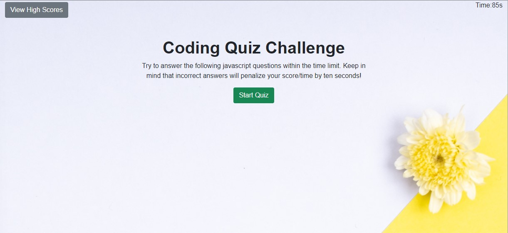
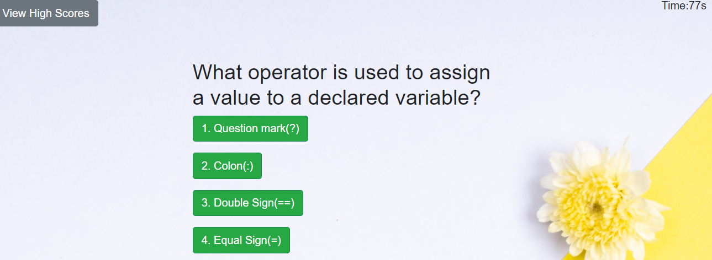
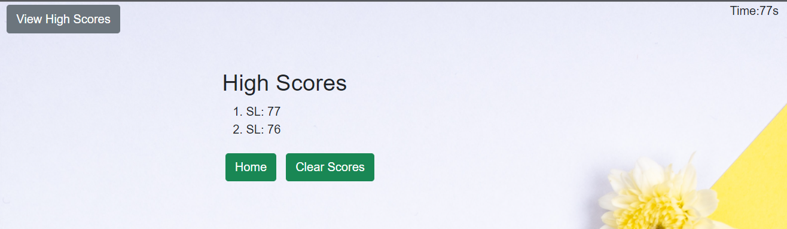

## TASK
The task is to build a timed coding quiz on Javascript fundamentals that the stores high scores of the quizzers so that the progress can be compared. The user's quiz score is based on the number of questions they get correct as time/score is subtracted from the clock for incorrect answers.  User scores are saved to the local storage and remain available for viewing (View HighScores) once the user has completed the quiz.


## ACCEPTANCE CRITERIA

The steps taken to meet the acceptance criteria of:-

```
GIVEN I am taking a code quiz
WHEN I click the start button
THEN a timer starts and I am presented with a question
WHEN I answer a question
THEN I am presented with another question
WHEN I answer a question incorrectly
THEN time is subtracted from the clock
WHEN all questions are answered or the timer reaches 0
THEN the game is over
WHEN the game is over
THEN I can save my initials and my score
```
1)  In the JS_CODE_QUIZ folder, I have created the following files:-

    * index.html - the structure of the landing page following closely the Mock-up given</dt>
    * style.css - the styling page where I keep the custom page.  Bootstrap was used.
    * script.js - for carrying out the functions to meet the required criteria

2) Free images were obtained from :

    <ddt>https://unsplash.com/wallpapers/colors/yellow?utm_source=unsplash&utm_medium=referral&utm_content=creditCopyText 
    to use as background image/color as the javascript file is yellow and this just represents that this is a testing site on Javascript fundamentals.</ddt>

3) The Javascript questions were taken from Unit 03: JavaScript Technical Interview Questions(Assessment) located at GitLab.

4) The below screenshots show the process the quizzer would go through to saving their initials and score and viewing the scores:-


    <dt>Start Quiz section - click on the Start Quiz button will bring on the Javascript Questions and the Timer</dt>



    <dt>Questions section - Where the user or quizzer will answer the questions by clicking on selected choices.</dt> 



    <dt>Submit scores section - where the user or quizzer can save their initials and scores.</dt>
    

    
    <dt>High scores section - where the user can view their scores and can also decide to do the quiz to get better score or just clear the scores and quit.</dt>



4) The layout is also responsive and caters for mobile, tablets and desktop.  I used three images for the background.

## DEPLOYMENT

The application is deployed on GitHub and the repository name is JS_CODE_QUIZ as the quiz is on testing Javascript fundamentals.

The URL of the GitHub respository is :-

https://github.com/stellalph/JS_CODE_QUIZ.git

The URL of the functional, deployed application is :-

https://stellalph.github.io/JS_CODE_QUIZ/


#### REFERENCES (other)

Google and Internet Explorer (Microsoft Edge) (My Best Friends)
The materials from The Unit Ahead: Web APIs


